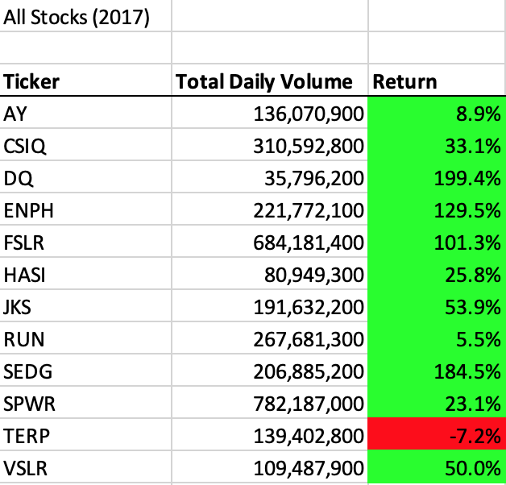
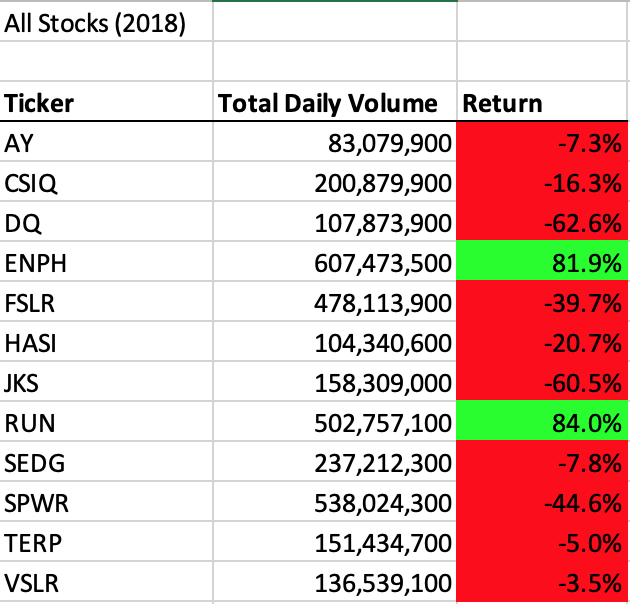
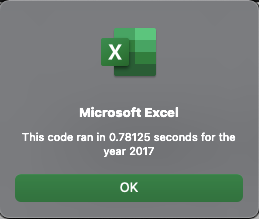
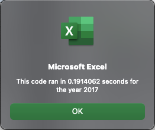
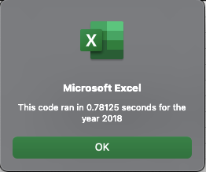
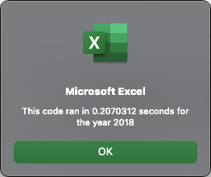

# An Analysis of Green Stock Returns (2017-18)

## Overview of the Project
This project was created to assist Steve's parents with investing in green energy stocks. Initially, Steve's parents only wanted to invest in Daqo New Energy (DQ), but Steve was rightfully concerned that it might be smarter to diversify these funds throughout an array of green stocks. Therefore, I created this analysis to display the differences between the returns of 12 unique green stocks throughout 2017 and 2018. By creating code through VBA in Excel, I was able to compile data from these 12 stocks for total volume and the yearly return. Since Steve wanted to quickly and cleanly view these datasets, I created interactive buttons on this sheet for him to easily cycle between the outputs for 2017 and for 2018. 

## Results
Results: Using images and examples of your code, compare the stock performance between 2017 and 2018, as well as the execution times of the original script and the refactored script. The analysis is well described with screenshots and code.
#### All Stocks (2017)
Based on the data from the table with "All Stocks (2017)" data, it would appear that Steve's parents might have been correct to invest all their money into DQ. As shown below, DQ had a nearly 200% return on investment from the start to end of 2017. However, you can also conclude that most of these green stocks yielded positive returns on investment. While they did not reach DQ's mark of +199.4%, it's evident that you would've made money by investing in any of these throughout the course of 2017 other than "TERP", which still only decreased by 7.2%. Even though 11/12 stocks had positive returns, there were some that notably outperformed the rest such as "DQ", "SEDG", "ENPH" and "FSLR", where the closing price increased by at least 100%. 

#### All Stocks (2018)
Compared to the data from 2017, the returns from 2018 do not show nearly as much success for these companies. While 11/12 of these stocks yielded positive returns in 2017, only 2/12 of these same companies had positive returns from the start to end of 2018. And even though a significantly higher volume of DQ stocks were traded in 2018 than 2017, this stock devalued the most at 62%. Across these two years, "ENPH" had a higher returns than any other stock. "ENPH" had the 3rd highest return in 2017 at 129%, and was also just one of two stocks to stay in the green in 2018. It also tripled its total daily volume in 2018 and still had an 82% increase in return. 

### Execution Times
When including a pop-up box that displays the run-time, we can see that the refactored code ran more than twice as fast as the original code. This difference was only about 0.6 seconds, which would likely not have been noticeable without this pop-up box. 

Below we can see the differences between the 2017 run times before and after refactoring the code. 

 

Below we can see the differences between the 2018 run times before and after refactoring the code. 

 

It's likely that I was able to improve the run time in the refactored code by replacing the 'nested for loops' with additional variables. The code I pasted below was essentially able to create and define new variables with a for loop rather than running a for loop within another for loop, yielding a faster response time.

```
For i = 0 To 11
        tickerVolumes(i) = 0
        tickerStartingPrices(i) = 0
        tickerEndingPrices(i) = 0
    Next i
```

## Summary

### Advantages and Disadvantages of Refactoring Code
Refactoring code can be beneficial in many ways. Not only can it help the program run faster, but it can also lead to easier debugging processes and maintainability in the future. One of the disadvantages would be that it might require more resources (time and money) to refactor a code that's already working. Coding can often be confusing, and while refactoring often beneficial results, the effort that is put into the refactoring process may not always match the benefits. 

### How do these pros and cons apply to refactoring the original VBA script?
